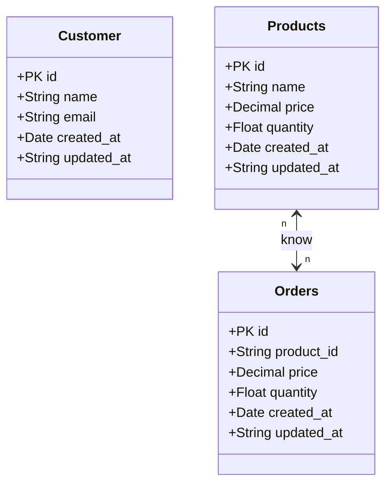

# gostack-challenge-typeorm-relations

# Diagrama Entidade Relacionamento

```mermaid

classDiagram


class Customer{
          +PK id
          +String name
          +String email
          +Date created_at
          +String updated_at
}

class Products{
          +PK id
          +String name
          +Decimal price
          +Float quantity
          +Date created_at
          +String updated_at
}

class Orders{
          +PK id
          +String product_id
          +Decimal price
          +Float quantity
          +Date created_at
          +String updated_at
}


Products "n" <--> "n" Orders : know
```
